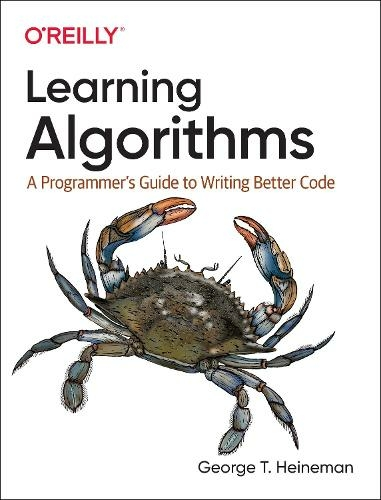

<table border="0">
<tr>
<td>  </td>

<td>
<h2>Learning-Algorithms</h2>
C# Implemention of Code repository associated with Learning Algorithms: A Programmer's Guide to Writing Better Code.
 </td>
</tr>
</table>


<a href="https://www.codefactor.io/repository/github/ashkanyarmoradi/learning-algorithms"></a>
<a href="https://codeclimate.com/github/AshkanYarmoradi/Learning-Algorithms/maintainability"></a>
<a href="https://codecov.io/gh/AshkanYarmoradi/Learning-Algorithms"></a>
<a href="https://gitmoji.carloscuesta.me">
  </a>

---

## Getting Started

This is an Implemention by c# and .net core of code repository associated with Learning Algorithms: A Programmer's Guide to Writing Better Code.

- This Project write in Mediator Design Patern

- Every Algorithm has their Test

- Every Algorithm run automaticly measured on time by mediator 

```csharp
[xUnit.net 00:00:00.44]   Starting:    LearningAlgorithms
Request Start at: 12:29:57
Request End at: 12:29:57
Total Milliseconds: 11.4631
```
  
  - So for contributing on this project just you need write Request and handler wich is Algorithms you want to build


***


***